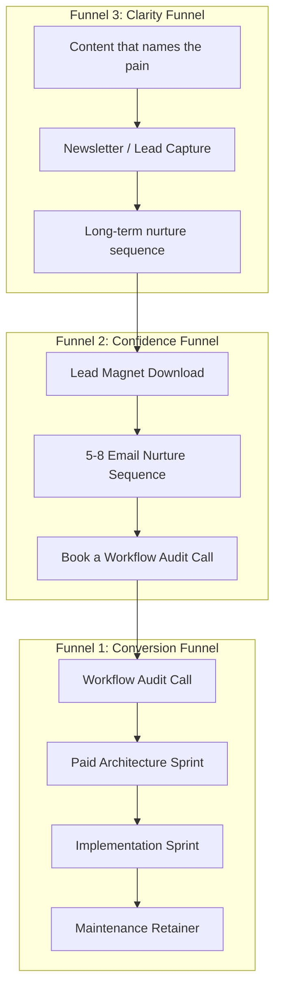

# Upcraft Crew Revenue Growth Plan

Based on Profitable Skills' 3-Funnel System, mapped to the positioning defined in [AGENTS.md](AGENTS.md).

---

## Current State Assessment

Your AGENTS.md already has strong fundamentals that most agencies lack:

- **Problem-first positioning** ("We help teams replace broken workflows...")
- **Outcome-selling** (not technology)
- **Strict scope boundaries** (no ERP traps)
- **Paid discovery** (Architecture Sprint as Stage 1)
- **Complexity-based pricing** (not hourly)

These are excellent foundations. The gap is not in your delivery model — it's in the **client acquisition system** that feeds it. Right now, you likely rely on referrals, word of mouth, or manual outreach — none of which you control.

---

## The 3-Funnel System Applied to Upcraft Crew

---

## Funnel 1: Conversion Funnel (Build First — Weeks 1-3)

This is your "bottom of funnel." It handles people who are already interested and turns them into paying clients. Your AGENTS.md two-stage model IS the conversion funnel — it just needs to be packaged for the buyer.

### 1.1 Reframe the Workflow Audit as Your Entry Offer

Your AGENTS.md already defines this: _"Workflow Audit calls, Paid Architecture Sprints."_ Make it explicit and sellable:

- **Name:** "Workflow Audit" (free 30-min call) leading to "Architecture Sprint" (paid, 2-3 weeks)
- **Promise:** "In 30 minutes, we'll identify the ONE broken workflow costing your team the most time and money"
- **Qualification:** Add an intake form that asks:
  - What manual process causes the most friction?
  - How many people touch this workflow?
  - What tools are you currently using (spreadsheets, email, chat)?
  - What's your timeline and budget range?
- This filters out tire-kickers and pre-qualifies leads before you ever get on a call

### 1.2 Build a Sales Page Around Outcomes, Not Services

Replace service listings with outcome-focused messaging aligned to AGENTS.md:

- "Replace broken approval chains with automated workflows"
- "Turn spreadsheet chaos into real-time dashboards"
- "Eliminate manual data entry errors with validation systems"

Each should include: the problem, who it affects, what the solution looks like, and a case study.

### 1.3 Price Anchoring Through Complexity Bands

Your AGENTS.md defines 3 bands. Make them visible to prospects (ranges, not exact numbers):

- **Band 1 (Standalone Workflow):** $3K-$8K — self-contained, no integrations
- **Band 2 (Moderate Integrations):** $8K-$20K — 1-2 external APIs
- **Band 3 (Legacy/Enterprise):** $20K+ — complex discovery required

This pre-frames pricing expectations and attracts the right budget level.

### 1.4 Case Studies That Prove Impact

Create 2-3 case studies following this structure:

1. **Situation:** "Team X was using spreadsheets + email to manage material requests..."
2. **Problem:** "Approvals took 3 days, errors happened weekly, no visibility..."
3. **Solution:** "We built a bounded approval workflow in 4 weeks..."
4. **Result:** "Processing time dropped from 3 days to 2 hours. Errors reduced by 90%."

These are your most powerful sales assets. Every claim in AGENTS.md should be backed by a real story.

---

## Funnel 2: Confidence Funnel (Weeks 3-6)

This captures people who are interested but not ready to buy. It builds trust automatically through a lead magnet and email sequence.

### 2.1 Create a Lead Magnet

A downloadable resource that your ideal client (operations managers, team leads, SMB owners) would find valuable. Options aligned to your AGENTS.md positioning:

- **"The Workflow Audit Checklist: 7 Signs Your Manual Process Is Costing You Money"**
  - Self-assessment checklist
  - Each sign maps to a workflow problem you solve
  - Ends with a CTA to book a Workflow Audit call
- **"From Spreadsheet to System: A Decision Framework for Operations Teams"**
  - Helps them decide whether to keep their spreadsheet or build a tool
  - Positions your Architecture Sprint as the logical next step

### 2.2 Build a 5-Email Nurture Sequence

Using Resend (already in your stack), build an automated sequence:

| Email  | Purpose             | Content                                                                             |
| ------ | ------------------- | ----------------------------------------------------------------------------------- |
| Day 0  | Deliver lead magnet | "Here's your checklist + a quick story about a team that was in your shoes"         |
| Day 2  | Name the pain       | "The hidden cost of manual workflows (most teams underestimate this by 3x)"         |
| Day 5  | Show proof          | Share a case study — before/after of a workflow you fixed                           |
| Day 8  | Handle objections   | "Why this isn't an ERP project (and why that matters for your budget and timeline)" |
| Day 12 | Call to action      | "Book a free 30-minute Workflow Audit — here's what we'll cover"                    |

### 2.3 Add Lead Capture to Your Website

- Add a lead magnet download form on the homepage and relevant pages
- Use a subtle popup or inline CTA: "Still using spreadsheets for approvals? Download our free checklist."
- Gate the resource behind email capture — this feeds the nurture sequence

---

## Funnel 3: Clarity Funnel (Weeks 6-12)

This targets the largest audience segment: people who feel the pain of broken workflows but don't know the solution exists. This is your long-term pipeline builder.

### 3.1 Content Strategy (Pick One Platform + Newsletter)

Choose **LinkedIn** (best for B2B operations audience) and commit to 2-3 posts per week. Content pillars aligned to AGENTS.md:

1. **"Broken workflow" stories** — describe real situations where manual processes cause chaos (anonymized client examples)
2. **"Spreadsheet vs. System" comparisons** — show the tipping point where spreadsheets stop working
3. **"Workflow fix" breakdowns** — quick explainers of how a bounded workflow solution works
4. **Process thinking** — short posts about operational clarity, scope discipline, outcome-focused delivery

### 3.2 Newsletter for Long-Term Nurture

Weekly or biweekly newsletter: "The Workflow Fix" (or similar)

- Short, tactical content about operational efficiency
- One workflow problem + insight per issue
- Occasional case study or behind-the-scenes
- Always a soft CTA to download the lead magnet or book a call

### 3.3 Long-Term Email Nurture (30-90 Days)

For newsletter subscribers who don't convert immediately, build an extended drip:

- Weekly value emails for 8-12 weeks
- Mix of education, stories, and social proof
- Gradually increase urgency: "Teams that wait 6 months to fix this end up spending 3x more"
- Monthly "office hours" or AMA to create direct connection

---

## Revenue Model Optimization

### Current Gap: No Recurring Revenue Engine

Your AGENTS.md mentions maintenance retainers but treats them as optional add-ons. Flip this:

- **Make retainers the default** — every project ends with a retainer proposal
- **Tier the retainers** around value, not hours:
  - Monitoring + small tweaks: $500/month
  - Priority support + monthly improvements: $1,500/month
  - Strategic partner (roadmap input + feature development): $3,000/month
- **Track retainer revenue separately** — this is your baseline that covers overhead

### Productize the Architecture Sprint

Your Stage 1 is your most unique differentiator. Productize it:

- Fixed price: $2,000-$5,000 depending on complexity
- Clear deliverables: workflow diagram, architecture outline, risk map, fixed proposal
- Standalone value even if they don't proceed to Stage 2
- This is revenue from day one, not free consulting

---

## Implementation Priority

| Priority | Action                                   | Timeline | Impact                              |
| -------- | ---------------------------------------- | -------- | ----------------------------------- |
| 1        | Qualification form + sales page rewrite  | Week 1-2 | Filters leads, increases close rate |
| 2        | Write 2-3 case studies                   | Week 2-3 | Core trust-building asset           |
| 3        | Create lead magnet (checklist/guide)     | Week 3-4 | Captures leads for nurture          |
| 4        | Build 5-email nurture sequence in Resend | Week 4-5 | Automates trust-building            |
| 5        | Productize Architecture Sprint pricing   | Week 3   | Immediate revenue from discovery    |
| 6        | Start LinkedIn content (2-3x/week)       | Week 5+  | Long-term pipeline                  |
| 7        | Launch newsletter                        | Week 6+  | Long-term nurture                   |
| 8        | Standardize retainer proposals           | Week 4   | Recurring revenue baseline          |

---

## Key Principle

Everything above respects the core identity in AGENTS.md: **bounded, outcome-focused, scope-disciplined.** You are not becoming a marketing agency or a content machine. You are building a system that communicates your existing value to the right people, automatically, so you stop relying on referrals and start controlling your pipeline.

The Profitable Skills insight that matters most for Upcraft Crew: **You don't need a big audience. You need a system that makes the right 100 people trust you before they ever get on a call.**
